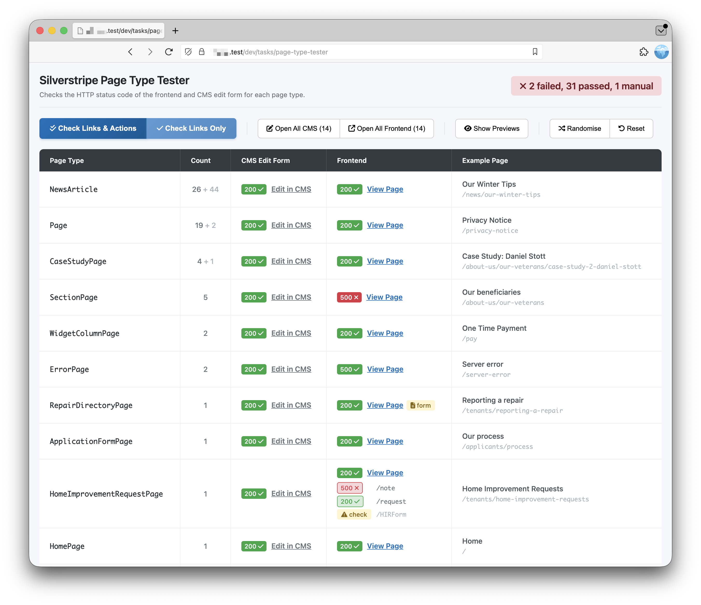

# Silverstripe Page Type Tester

A Silverstripe BuildTask that provides a visual interface for testing all page types in your site. Useful for verifying pages work correctly after upgrades or major changes.



## Features

- Lists all page types with CMS edit and frontend links
- Automatically checks HTTP status codes for all links
- Shows page count per type (sorted by count)
- Handles ErrorPage correctly (expects 404/500)
- Visual status indicators (✓ pass / ✗ fail)
- Click status badges to re-check individual links
- "Open All" buttons to open CMS or frontend links in new tabs
- Optional page preview thumbnails
- Randomise selected pages for broader testing
- Progress indicator with stop functionality
- Works in both browser and CLI

## Requirements

- Silverstripe 6.0+
- PHP 8.1+

## Installation

```bash
composer require purplespider/silverstripe-page-type-tester
```

## Usage

### Browser (Recommended)

Visit `/dev/tasks/page-type-tester` in your browser while logged in as admin.

The task will automatically check all links on page load and display:
- Page type names with counts
- CMS edit links with status codes
- Frontend links with status codes
- Example page titles and URLs

### CLI

```bash
vendor/bin/sake tasks:page-type-tester
```

The CLI output shows a simplified list of all page types with their CMS and frontend URLs.

## License

BSD-3-Clause
