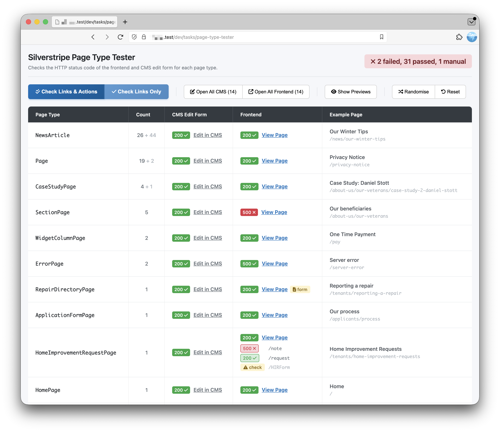

# Check Page Type Statuses

A Silverstripe BuildTask that provides a visual interface for testing all page types in your site. Useful for verifying pages work correctly after upgrades or major changes.



## Features

- Lists all page types with CMS edit and frontend links
- Automatically checks HTTP status codes for all links
- Shows page count per type (live + draft) sorted by count
- Handles ErrorPage (expects 404/500) and RedirectorPage (expects a redirect)
- Visual status indicators, with an icon as well as a colour so pass/fail is never signalled by colour alone
- Detects when you are not logged in to the CMS and says so, rather than reporting every CMS URL as a 302 failure
- Status badges are buttons: click or tab to them and press Enter to re-check a single link
- Detects and tests controller `$allowed_actions`
- Detects forms on pages (flags for manual testing)
- "Create" buttons to add a test page for any page type that has none, and delete them again afterwards
- "Open All" buttons to open CMS or frontend links in new tabs
- Optional page preview thumbnails
- Randomise selected pages for broader testing
- Progress indicator with stop functionality
- Prioritises live pages over draft pages
- Works in both browser and CLI

## Requirements

- Silverstripe 6.0+
- PHP 8.1+

## Installation

```bash
composer require purplespider/silverstripe-page-type-status-checker
```

## Usage

### Browser (recommended)

Visit `/dev/tasks/check-page-type-statuses` in your browser while logged in as admin. Checks start automatically.

Click "Check Links & Actions" to check all links including controller actions, or "Check Links Only" for a faster check of just the main pages. While checks are running, the active button becomes a Stop control.

If you are not logged in to the CMS, every CMS and admin URL redirects to the login screen. Rather than filling the table with 302s, the task detects this, shows a banner with a "Log in to the CMS" button, and marks those rows `login` instead of failed. Frontend pages are still checked as normal.

### CLI

```bash
vendor/bin/sake tasks:check-page-type-statuses
```

The CLI has no CMS session, so CMS and admin URLs will always redirect to the login screen. These are reported as `login required` rather than counted as passed or failed. Use the browser version to check them properly.

The command exits with a non-zero status if any check fails, so it can be used in a pipeline.

### Options

| Option | Description |
| --- | --- |
| `--skip-actions` | Skip checking `allowed_actions` URLs |
| `--skip-admin` | Skip ModelAdmin sections and SiteConfig |
| `--randomise` | Pick a random example page per type instead of the first |
| `--live-domain=URL` | Add "Live CMS" and "Live Page" comparison links, and a side-by-side Compare button |
| `--verify-ssl=0\|1` | Verify TLS certificates. Defaults to off in dev mode, on elsewhere |

All options also work as query string parameters in the browser.

## Configuration

```yaml
PurpleSpider\PageTypeTester\ActionLinkFinder:
  # Actions that resolve without an ID, so a URL can be built even when the page
  # contains no link to them.
  direct_actions:
    - rss
    - index

PurpleSpider\PageTypeTester\Report\HtmlReport:
  # How many checks the browser runs at once. Lower this for slow or rate-limited sites.
  check_concurrency: 6
```

## How it decides what passed

- Redirects are **not** followed. A page that redirects is reported with its own status rather than the status of wherever it points, so a page silently redirecting to the home page shows as a failure rather than a pass. The CLI and browser reports agree on this.
- `ErrorPage` is expected to return 404 or 500, `RedirectorPage` a 3xx, and everything else a 200.
- An action URL is only matched when it sits beneath the page's own URL. Links elsewhere on the page (navigation, footer) are ignored, since those belong to other page types.
- Where no link to an action is found, it is reported as needing a manual check rather than passed or failed.

## Comparing against the live site

Setting a live domain adds a "Live CMS" and "Live Page" link beside each local link, and a **Compare** button after each pair. Compare opens the local and live version of the same thing in two windows, side by side, half the screen each.

Windows rather than an embedded side-by-side view, because embedding cannot work:

- Silverstripe sends `X-Frame-Options: SAMEORIGIN` on the admin (`LeftAndMain.frame_options`), so a live CMS screen can never be framed from another origin.
- Plenty of sites send the same header for every response, at the web server or CDN, which leaves the live half of any embedded view blank.
- Scroll position cannot be synchronised across origins either, so linked scrolling between two embedded pages is not possible against a real live site.

A window is a top-level browsing context, so none of that applies: the live CMS stays logged in, the page renders exactly as it normally does, and both halves are real.

Browsers that ignore the requested size and position open ordinary tabs instead, which is still both pages, just not arranged. If pop-ups are blocked, the button says so.

## Creating and deleting pages

Page types with no instances get a "Create" button, so a type can be checked without hand-building a page in the CMS. Creating a page:

- requires POST with a valid security token, so it cannot be triggered by following a URL, by a crawler, or by browser prefetch;
- respects the page type's `canCreate()`, so page types that restrict creation (for example to enforce a single instance) are not bypassed.

Every page created this way gets a small "Delete" button after its name, and a "Delete Created Pages (n)" button appears in the toolbar to clear them all at once. The toolbar button is hidden until something has been created. Deleting:

- requires POST with a valid security token, as creating does;
- respects the page's `canDelete()`;
- only accepts IDs this report created during the current session. The list is held in the session, so the endpoint can never be pointed at pre-existing content, and the buttons disappear once the session ends.

Deleting archives the page, which is what the CMS delete button does: it comes off draft and live but remains recoverable from the CMS archive.

## Development

`PageTypeTesterTask` handles options and orchestration only. The collectors gather page types and admin sections, `UrlChecker` performs the requests, and the two classes under `Report/` render the terminal and browser output from the same data.

The browser report writes a JSON config block and loads `client/dist/page-type-tester.js`, so no server data is interpolated into JavaScript. Those client files are plain CSS and JS exposed via `extra.expose`; if either 404s after a change, run `composer vendor-expose`.

## License

BSD-3-Clause
